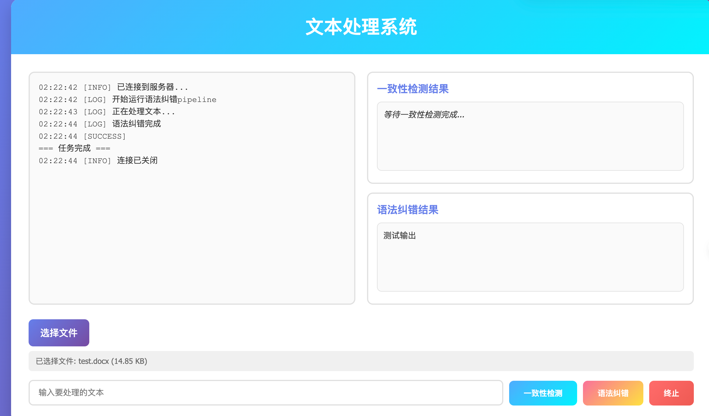
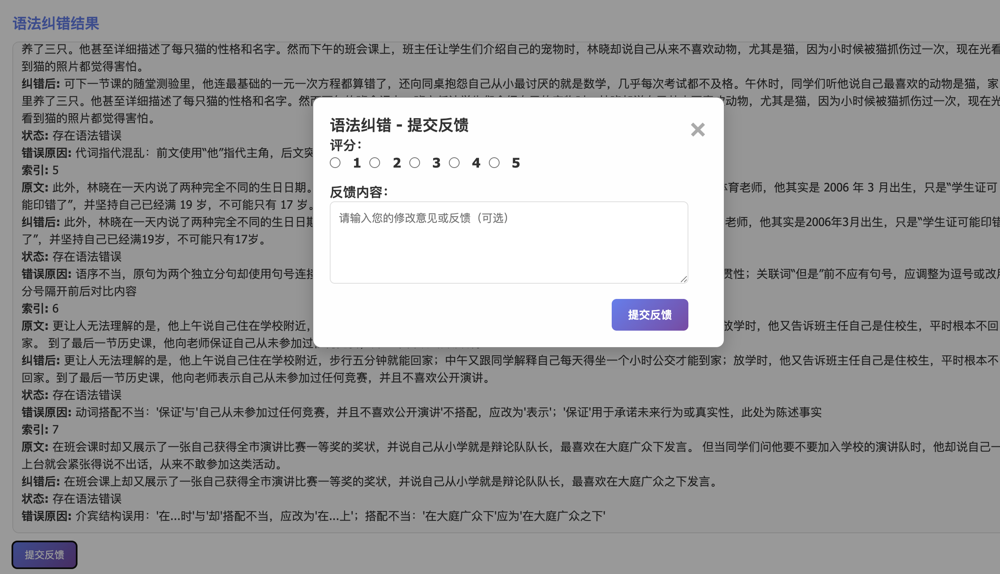
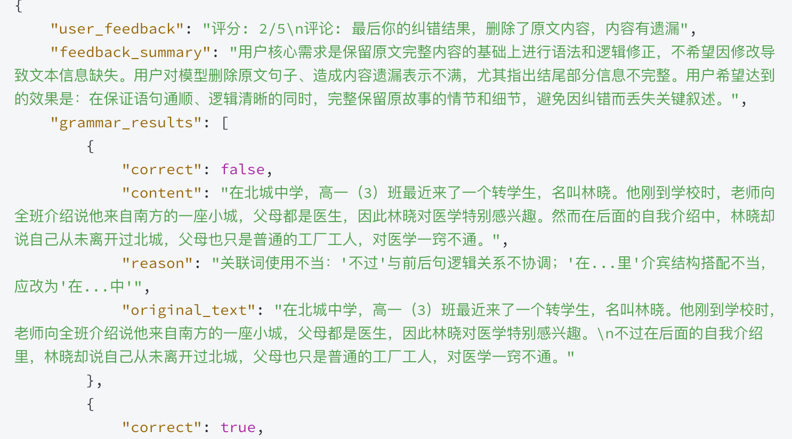

# Long Text Semantic Consistency Detection and Chinese Grammar Correction System

**[English](README_EN.md)** | **[中文](../../README.md)**

A Chinese text processing system developed based on large language models and LangChain, providing long text semantic consistency detection and Chinese grammar correction functions.

## Application Scenarios

The core goal of the system is to provide efficient semantic consistency detection and Chinese grammar correction services for `long text scenarios`.
By introducing the `Human-In-The-Loop` mechanism, it implements manual preference correction of detection results and adjusts model output strategies.

- **Legal Document Review**: Automatically check grammar errors and entity consistency in legal documents
- **Academic Paper Check**: Automatically check grammar errors and entity consistency in academic papers
- **Professional Document Self-Check**: Automatically check grammar errors and entity consistency in customer service records

## Features

- **Chinese Grammar Correction**: Automatically detect and correct grammar errors in text
- **Text Entity Extraction**: Automatically identify key entities in text
- **Entity Consistency Check**: Detect whether entity descriptions are consistent throughout the text
- **Multi-format Support**: Support direct text input or upload of docx/pdf files
- **Real-time Communication**: Real-time detection progress feedback based on WebSocket
- **Friendly Interface**: Modern Web interface with simple and intuitive operation


- **Human-In-The-Loop**: Introduce manual feedback mechanism to adjust model output strategies

Feedback Result Example

## Technology Stack

- **Backend Framework**: FastAPI
- **Frontend Technology**: HTML5, JavaScript
- **Large Language Model**: Alibaba Cloud Tongyi Qianwen (qwen-plus)
- **LLM Application Framework**: LangChain
- **File Processing**: Support docx and pdf formats
- **Package Management**: uv (Python package management tool)
- **Deployment Method**: Local server

## Installation Instructions

### Environment Requirements

- Python 3.10+
- uv package management tool

### Installation Steps

1. Clone the project

```bash
git clone https://github.com/WitBlue6/TextGuard
```

2. Install dependencies (using uv)

```bash
uv sync
```

3. Configure environment variables

Create a `.env` file in the project root directory and configure model-related parameters:

```dotenv
# Model Configuration
OPENAI_API_KEY=sk-xxxx
```

## Usage

### Start the Service

```bash
# Run using uv
uv run run.py
```

The service will start at `http://localhost:8000`

### Using the Web Interface

1. Open a browser and visit `http://localhost:8000`
2. Enter the text to be detected in the text box, or click "Select File" to upload a docx/pdf file
3. Click the "Consistency Detection" or "Grammar Correction" button to start detection
4. View real-time detection progress and results in the log area
5. Manually correct the generated results and click the "Submit Feedback" button

### API Usage

#### HTTP API

```bash
POST /chat
```

Parameters:
- `message`: Text content (optional)
- `history`: Historical conversation records (optional)
- `file`: Uploaded file (optional, docx/pdf format)

#### WebSocket API

```bash
ws://localhost:8000/ws/chat
```

Sending message format:
```json
{
  "message": "Text to detect",
  "file": {
    "filename": "filename",
    "content": "base64-encoded file content"
  }
}
```

## Project Structure

``` plaintext
├── README.md
├── consistency_check.py   # Semantic consistency detection
├── feedback.py            # Manual feedback module
├── grammar_correction.py  # Chinese grammar correction
├── dataset                # Dataset
├── filereader             # PDF/DOCX file reading module
│   ├── __init__.py
│   └── reader.py
├── frontend               # Web frontend interface
│   └── static
│       ├── chat.js
│       └── index.html
├── llm                    # Langchain-related modules
│   ├── __init__.py
│   ├── entity.py          # Entity extraction module
│   ├── memory.py          # Memory management module
│   ├── model.py           # Chain definition
│   └── prompt.py          # SP template definition
├── logs
├── main.py                # Main application entry
├── pyproject.toml
├── run.py                 # Startup script
├── test                   # Test scripts
│   ├── test_model.py
│   └── test_reader.py
├── uv.lock
└── web.py                 # FastAPI application entry
```

## Configuration Instructions

The system can be configured through command-line parameters or environment variables:

| Parameter Name | Type | Default Value | Description |
|---------------|------|---------------|-------------|
| --model_name | str | qwen-plus | Model name to use |
| --base_url | str | https://dashscope.aliyuncs.com/compatible-mode/v1 | Model API address |
| --log_dir | str | ./logs | Log file directory |

## Working Principle

1. **Text Processing**: Chunk the input text for processing
2. **Grammar Correction**: Use LangChain-built grammar correction Chain to detect and correct grammar errors in text
3. **Entity Extraction**: Extract entity information from each text chunk
4. **Memory Management**: Use LangChain's memory mechanism to maintain entity context information
5. **Consistency Check**: Use LangChain's entity analysis Chain to perform cross-text consistency checks on each entity
6. **Result Output**: Return check results and detailed logs
7. **Manual Feedback**: Users can manually correct model-generated results, and LLM will summarize experience based on user feedback and store it in files
8. **RAG Update**: Regularly update the RAG knowledge base based on manual feedback to improve detection accuracy

## Development Instructions

### Frontend Development

Frontend files are located in the `frontend/static/` directory and can be directly modified for customization.

### Backend Development

- API routes are defined in `web.py`
- Core logic is located in `consistency_check.py` and `grammar_correction.py`
- LangChain-based model calling code is in the `llm/` directory
  - `model.py`: Defines various LangChain Chains (grammar correction, entity extraction, consistency check, etc.)
  - `entity.py`: Entity management related functions
  - `memory.py`: Context memory management
  - `prompt.py`: Prompt template definitions

## Dependency Management

The project uses uv for dependency management, with configuration file `pyproject.toml` and dependency lock file `uv.lock`.

## Logs

System logs are saved in the `logs/consistency_check.log` file, and log levels and formats can be adjusted through configuration.

## License

MIT License